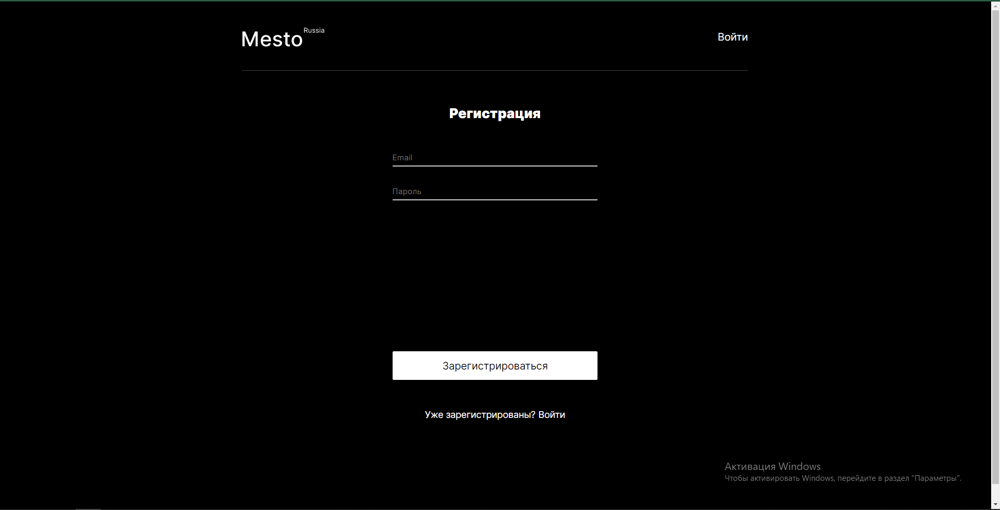
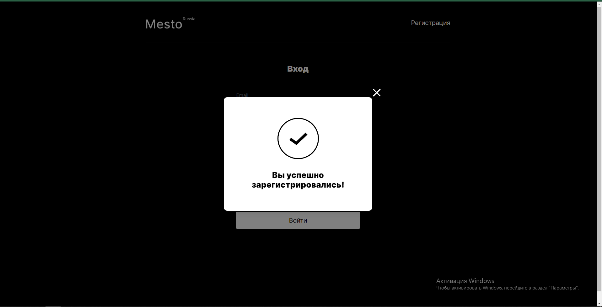
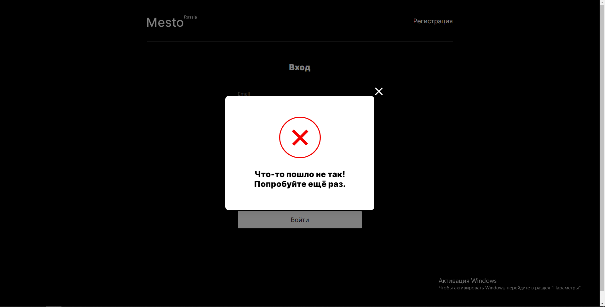
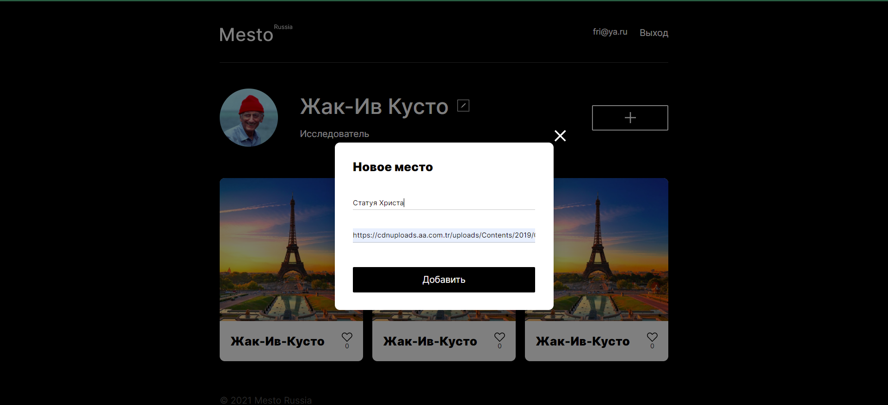
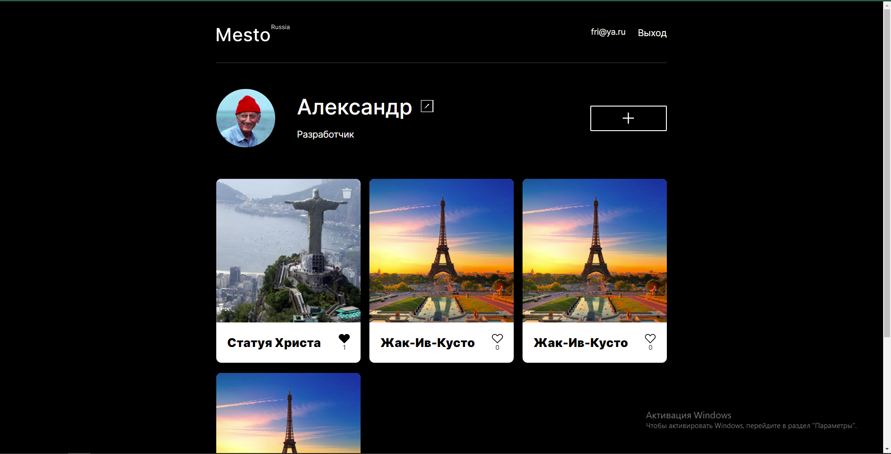

## Проект Mesto

# Описание.

Данный проект является учебным аналогом Instagram. В нем представлены следующие возможности:

1. Регистрация пользователя.
2. Вход в аккаунт пользователя.
3. Выход из профиля.
4. Редактирование профиля.
5. Добавление/удаление карточки.
6. Поставновка и удаление лайка, счетчик лайков.

Проект имеет собственную серверную часть, написанную с использованием Node.js (Express.js).

Технологии, которые применялись при реализации проекта.

- HTML5
- CSS3
- JS
- React.js
- Express.js
- Git
- mongoDB

Скриншоты приложения: 

Регистрация

Регистрация прошла успешно!

Ошибка входа

Добавление карточки

Главная страница (удаляются только свои карточки - значок корзины в верхнем правом углу)

